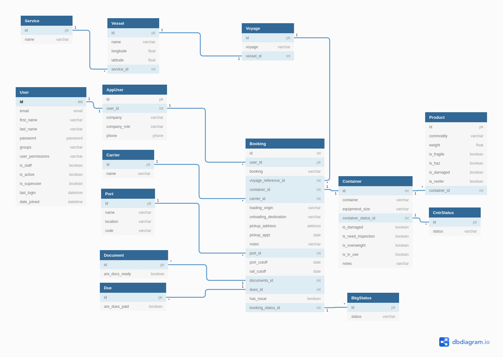

# Project

ShipItOut is my full stack NSS C46 capstone project. It is related to my initial project, [PackItUp](https://github.com/CheoR/pack-it-up) - track what you pack, app.

ShipItOut consist of React front-end and Django backend.

It is a dashboard-like app that tracks shipping containers where the shipper, container, port authorities can update the container status as it moves.

[](https://travis-ci.com/CheoR/shipItOut-server)

Backend repo [here](https://github.com/CheoR/shipItOut-server).

## Motivation

I come from the transportation/logistics/freight shipping industries and often times the tools we used to track maintenace/inventory/shipments were clunky and outdated.

This is a simple version of something I would wanted to use.

## Prerequisites

1. Clone repo with `git@github.com:CheoR/shipItOut-client.git`
2. Run `npm install`
3. Run `npm start`

```bash
    $ git clone git@github.com:CheoR/shipItOut-client.git
    $ npm install
    $ npm start
```

## Project ERD

Open the [Latest ShipItOut db diagram](https://dbdiagram.io/d/60be3bdfb29a09603d1855af) in the browser to view the tables and relationships for the database.

<details>
  
</details>

## Wireframe


